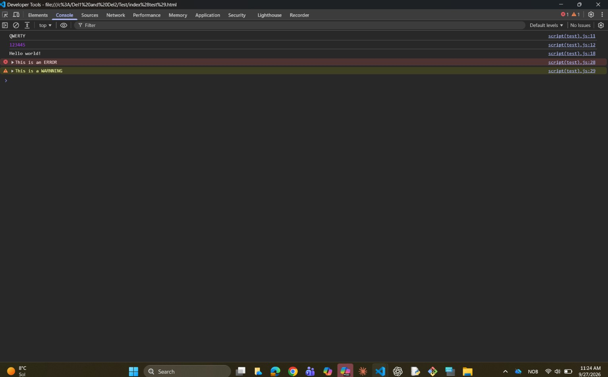
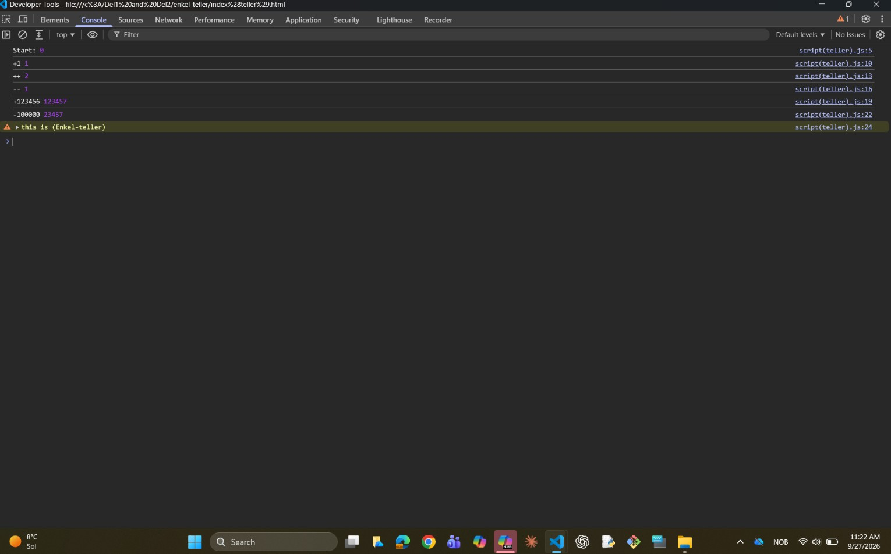

# Uke39-del-1.1-Markdown-and-GITHUB
### Disse er **del-1.1** (Markdown og lærer å bruker GITHUB)

I dette prosjektet har jeg testet ut Git, GitHub og Markdown. Jeg lagde et repo på GitHub, klonet det ned til PC-en min, og lagde filen practice.md for å øve på Markdown.

## Mine refleksjoner

### Hva har du lært om Git og GitHub?
Jeg har lært å lage et repository på GitHub, hente det ned til PC-en mitt, og lagre endringer ved å bruke commit og push.

### Hva synes du om å bruke versjonskontroll?
Det er veldig kjekt! Veldig greit å ha alt lagret trygt på nett så jeg ikke mister noe hvis noe skjer med PC-en.

### Hva har du lært om Markdown?
Jeg har lært hvordan jeg pynter på tekst med overskrifter, lister, lenker, bilder og kodeblokker.

### Hvordan kan Markdown brukes til dokumentasjon?
Det gjør det superenkelt å skrive fine og ryddige forklaringer til prosjektene sine.

### Hva var mest utfordrende?
Det var litt uvant å skjønne hvordan filene kobles sammen mellom PC-en og GitHub helt i starten.

# Uke39-del-2-blir kjent med "Javascript"

### Disse er **del-2** (Lærer å bruk java script og enkel teller med Javascript)
I disse oppgave lærte jeg hvordan man bruke Javascript og console, jeg også har lært at hvordan man kan teller med Javascript.

### Hva jeg har prøvd ut

1. **Oppgave test**: Opprettet en mappe med index.html og script.js for å teste console.log(), definere variabler og kalle på en enkel funksjon.
2. **Oppgave enkel-teller**: Opprettet en mappe med en teller-variabel for å se hvordan verdier kan økes og minkes mens programmet kjører.

### Eksempel på kode (Enkel teller)

'''Javascript
let number = 0;

number += 50;
 console.log("etter +50", number)//viser på console//

'''

### skjermbilde av Test, Enkel teller

**test**

**Enkel teller**

